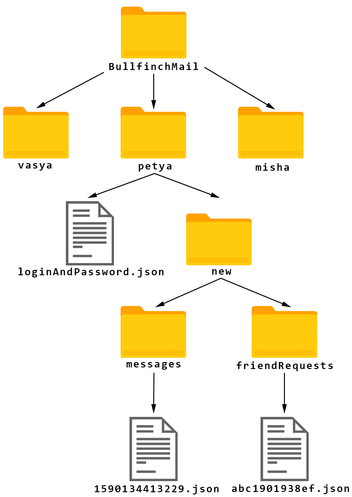

# ServerBullfinchMail

## Текст программы: [Server](https://github.com/vasilievan/ServerBullfinchMail), [Client](https://github.com/vasilievan/ClientBullfinchMail)

## Общие сведения
В приложении реализована клиент-серверная архитектура. Обе части были написаны на языке *Kotlin* (v. 1.3.71). Главной задачей было обеспечить высокую надежность хранения данных пользователей, что и было реализовано на всех уровнях приложения.

## Серверная часть
Приложение состоит из 3 пакетов: **entry**, **general** и **specific**. Т.к. оно было разработано под *Ubuntu Server OS*, графического интерфейса нет, – это консольное приложение.

### Пакет entry
Точка входа в программу. Содержит лишь один класс **Main**, в котором создаются *ServerSockets* на выделенные порты (было выделено 9 портов), инициализируется своеобразная “база данных”. Создается один генератор ключей для ассиметричного алгоритма шифрования *RSA* в целях экономии памяти и повышения быстродействия работы программы. Ключ представляет собой простое число больше, чем 2^1024. Это соответствует принятым сегодня стандартам шифрования. Кроме того создается поток для получения консольной команды о закрытии всех сокетов.
 
### Пакет general
Содержит разделяемую логику, общую для многих классов приложения.
Класс **Constants** содержит константы, используемые классами приложения, например, длину ключа, тип алгоритма шифрования, кодировку символов; кроме строк, связанных с работой протокола и логами.
Класс **DataBase** – это собственное решение для базы данных, т.к. современные СУБД не соответствуют требованиям безопасности и криптозащищённости, необходимыми для работы данного приложения.
Найденное решение – хранение данных на диске в текстовых файлах в формате *JSON*. Используемая библиотека *java.nio.file* гарантирует атомарный доступ при работе с файлами, что необходимо для данного проекта. Т.к. у пользователя может быть лишь один клиент (одно устройство с программой мессенджера), все операции должны обладать свойствами транзакций.
Достоинства текстовых файлов в том, что файловая система гарантированно удаляет их из памяти компьютера. Один из главных недостатков – чтение/запись происходит медленнее, чем в БД (БД кэшируют данные). Но скорость не являлась приоритетной задачей. Мессенджер работает медленнее, чем, например, *Telegram*, но достаточно быстро, чтобы не вызывать раздражение пользователя при работе с ним. Например, отправка сообщения занимает 1-1,5 с, а сообщения приходят с максимальным опозданием в 5 с.
База данных представляет собой файловую систему, представленную на изображении ниже:

Рис 1.1 - Структура базы данных сервера.

В документе *loginAndPassword.json* хранится логин пользователя, соль для пароля, хэш пароля и имя пользователя.
Хэш пароля находится по алгоритму *PBE*, к-во итераций – 65536. Это позволяет исключить атаку на данные пользователя изнутри системы, если кто-то получит данные с сервера.
В папке *messages* хранятся новые сообщения, которые тут же удаляются по получении. Гарантировано *Peer-to-peer* (*P2P*) шифрование, поэтому содержание сообщения, а также дата отправки зашифрованы в конечных узлах – на клиентах. Имя отправителя и получателя шифруется на клиенте и на сервере (не только при отправке сообщений, но и во всех остальных частях программы), поэтому не существует ни одного блока данных, который можно было бы ассоциировать с конкретным пользователем.
Кроме того на всех уровнях программы при генерации ключей или других псевдослучайных чисел используется класс *SecureRandom*, а также пакет *javax.crypto*. Всё это позволяет повысить уровень криптозащищённости приложения.
В папке friendRequests хранятся новые заявки в друзья. В заявку содержится имя отправителя и открытый ключ. Все данные также шифруются на всём канале связи. Документы с запросами удаляются по отправке.
Рассмотрим следующий класс **GlobalLogic**. В нем содержатся методы, общие для всех классов приложения: это чтение из буфера, авторизация пользователя, отправка данных пользователю и т.д.
В классе **ProtocolPhrases** описаны константы, использующиеся для логов и протокола общения с клиентом непосредственно.
В классе **Server** создается генератор пар ключей.

### Пакет specific
В нем описывается логика, необходимая для решения специфичных задач.
В классе **ChangingLogic** содержится метод для смены пользователем своего имени.
Класс **FriendsFindingLogic** отвечает за поиск контактов в мессенджере.
**MessagingLogic** позволяет отправлять сообщение от пользователя к пользователю. 
**PortListener** является ядром всей работы с сетью. В нём происходит работа с сокетами, обработка запросов, поступающих от пользователя, отправка ключей шифрования.
Класс **RegistrationLogic** предназначен для регистрации новых пользователей в системе. Гарантируется уникальность всех пользователей по логину.
**RequestLogic** позволяет обрабатывать запросы пользователя на появление новых заявок в друзья или сообщений.
